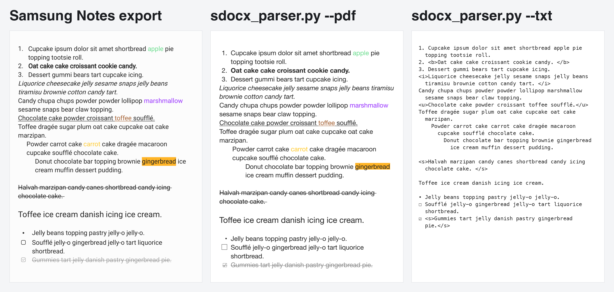
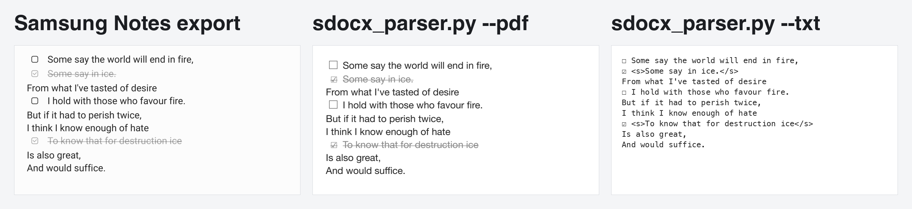
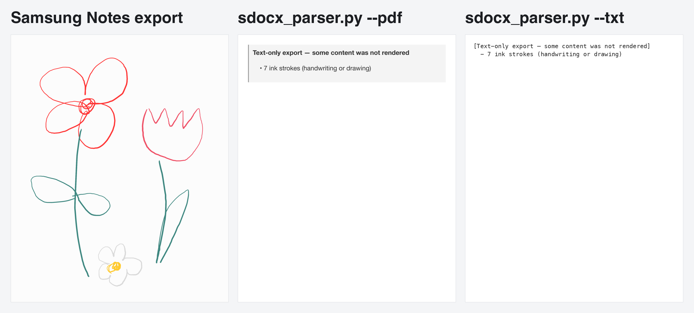
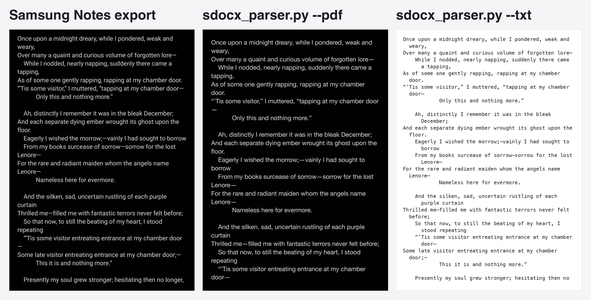

# Samsung Notes (`.sdocx`) Text + Formatting Parser

 [](https://www.gnu.org/licenses/gpl-3.0)

This repo pulls formatted text out of Samsung Notes (`.sdocx`) files and exports them to plain text, HTML or PDF.



The image above shows the `cupcake.sdocx` sample file: Samsung's own PDF export on the left, then the `--pdf` and `--txt` output from `sdocx_parser.py`.
 
---
 
## `sdocx_parser.py` - command-line converter
 
Point this script at a single `.sdocx` note, a folder of notes, or a folder where `.sdocx` archives have already been unzipped. It reproduces text formatting (bold, italic, underline, strikethrough, colour, highlight, size), list formatting (bullets, numbering, checkboxes, indent, alignment), and the note's page colours. Handwriting and images don't get rendered, but are logged.
 
### Installation
 
For HTML and text output, you need **Python 3.9+**.
 
PDF output works by rendering the HTML export through [WeasyPrint](https://weasyprint.org/). It's an optional dependency that only gets imported if you use `--pdf`.
 
```bash
pip install weasyprint
```
 
WeasyPrint also needs Pango, cairo, and GDK-PixBuf installed on your system:
 
| Platform | Command |
| --- | --- |
| macOS | `brew install pango libffi` |
| Debian/Ubuntu | `sudo apt install libpango-1.0-0 libpangoft2-1.0-0 libffi-dev` |
| Fedora | `sudo dnf install pango` |
| Windows | see the [WeasyPrint first-steps guide](https://doc.courtbouillon.org/weasyprint/stable/first_steps.html) |
 
### Output formats
 
| Flag | Output | Notes |
| --- | --- | --- |
| `--html` | `NOTE.html` | The default if you don't specify a format, and also what the PDF gets rendered from. |
| `--pdf` | `NOTE.pdf` | A4, paginated by WeasyPrint from the HTML. Needs WeasyPrint installed. |
| `--txt` | `NOTE.txt` | Plain UTF-8 — keeps bullets, checkbox state, and indentation. Bold, italic, underline and strikethrough are marked with `<b>`, `<i>`, `<u>` and `<s>` tags; colour, highlight and font size have no plain-text equivalent, so they're dropped. |
| `--all` | all three | Shorthand for `--html --pdf --txt`. |
 
### Exported file defaults
 
By default, the exported files include the note itself and nothing else, same as Samsung's own PDF export. Useful extras can be added to the exported files:
 
| Flag | Adds |
| --- | --- |
| `--include-title` | The note's title, as a heading at the top. |
| `--include-warning` | The notice listing what wasn't rendered — ink strokes, images, embedded PDFs. |
 
```bash
python3 sdocx_parser.py samples/sdocx/ --all --include-title --include-warning
```
 
Both are recorded in the log on every run whether or not you use the flags. The title also stays in the HTML `<title>` tag regardless, since that names the browser tab and the PDF metadata rather than showing up on the page. Note that the file title may be different to the file name.
 
To avoid completely empty files, any notes that have no typed text to export will **always** include the warning in the export, whether `--include-warning` is on or not.
 
### Example commands
 
**1. A single `.sdocx` file**
 
```bash
python3 sdocx_parser.py samples/sdocx/raven.sdocx --all -o out/
```
 
**2. A flat folder of `.sdocx` files**
 
```bash
python3 sdocx_parser.py samples/sdocx/ --html --txt -o out/
```
 
**3. A folder of already-unzipped `NOTE.sdocx/` directories**
 
```bash
python3 sdocx_parser.py extracted/ --pdf -o out/
```
 
A single unzipped note works fine as input too, and so does a whole tree of them if you add `-r`:
 
```bash
python3 sdocx_parser.py extracted/raven.sdocx/ --html
```
 
```bash
python3 sdocx_parser.py archive/ -r --all -o out/ --skip-existing
```
 
A directory counts as an unzipped note if it has a `note.note` file inside. 
Leave off `-o` and each output will be saved next to the input file. 
`--skip-existing` skips over anything that's already been converted, which makes it easy to resume a big batch partway through.
 
### All flags
 
| Flag | What it does |
| --- | --- |
| `--html`, `--pdf`, `--txt`, `--all` | Which formats to write. Defaults to `--html` if none are added. |
| `-o DIR`, `--output-dir DIR` | Write everything to `DIR` (created if needed) instead of next to each input. |
| `-r`, `--recursive` | Look in subfolders too. Unzipped `NOTE.sdocx/` directories count as notes, so they're not traversed. |
| `--skip-existing` | Don't overwrite outputs that already exist — resumes a long batch. |
| `--include-title` | Start each output with the note's title. Off by default. |
| `--include-warning` | Start each output with the notice about what couldn't be rendered. Off by default, except for notes with no typed text. |
| `--log-file PATH` | Write the run log somewhere other than `./sdocx_parser.log`. |
| `--no-log-file` | Console only, no log file. |
| `-v`, `--verbose` | Print all logged detail. |
| `-q`, `--quiet` | Print warnings and errors only. The log file still gets everything. |
 
Run `python3 sdocx_parser.py --help` for the full text on any of these.
 
### Logging
 
Every run gets appended to a log file — `./sdocx_parser.log` by default, though you can point it elsewhere with `--log-file PATH` or turn it off with `--no-log-file`. The log keeps track of:
 
* a header for each run, with the timestamp and the exact command you typed;
* every note as it's processed, along with each output file written;
* each note's title, whether or not `--include-title` put it in the output;
* what a note contained that couldn't be rendered, whether or not `--include-warning` put it in the output;
* notes skipped because their outputs already exist (`--skip-existing`);
* any failures, including the full traceback saved to the log;
* WeasyPrint's own warnings, when PDF output is being used.
 
Exit codes: `0` means everything requested got produced, `1` means at least one note failed or you asked for PDF without having WeasyPrint installed, and `2` means the run didn't start (i.e. bad input path).
 
---
 
## Acknowledgments
 
This project builds on work from a couple of other open-source repos:
 
* **[twangodev/sdocx](https://github.com/twangodev/sdocx)**
* **[squ1dd13/sdocx2pdf](https://github.com/squ1dd13/sdocx2pdf)**

Thanks to both authors for documenting key aspects of the `.sdocx` internal structure and binary schemas.
 
---
 
## Reverse Engineering: Bullet Points + Checkmarks
 
Existing documentation covered basic text structures, but skipped over the mechanics of bullet points and interactive checkmarks.

To map out how Samsung Notes handles these elements, I created a suite of controlled .sdocx test files (fire_and_ice) and compared the binary data against the rendered output. This revealed the underlying structures and flags for bullet formatting, check states, and indentation levels.

---
 
## Repository Contents + Samples
 
To make this easier to verify and build on, the repo includes:
 
* **`.sdocx` samples:** test files covering various formatting elements, including the `fire_and_ice` test suite.
* **PDF exports:** reference PDFs pulled straight from Samsung Notes which show exactly how each sample is supposed to look.

### Gallery

A few more samples outputs showing the first page of the `.sdocx`: Samsung's own PDF export on the left, then the `--pdf` and `--txt` output from `sdocx_parser.py`.

**`fire_and_ice_F.sdocx`** — the checkbox test case with ticked and unticked boxes.



**`flowers.sdocx`** — a note that only contains handwriting data. This is the one case where the notice box appears without explicity using `--include-warning`.



**`raven.sdocx`** — dark-themed.



---

## Testing

This parser has been tested against the 11 sample `.sdocx` documents included in this repo, all generated using Samsung Notes for Windows. If you run into a note that doesn't parse correctly i.e. from a different Samsung Notes version or platform (mobile/tablet) please open an issue if possible.

---
 
## License
 
Since this builds on GPL-licensed work, it's licensed under the **GNU General Public License v3.0 (GPL-3.0)**.